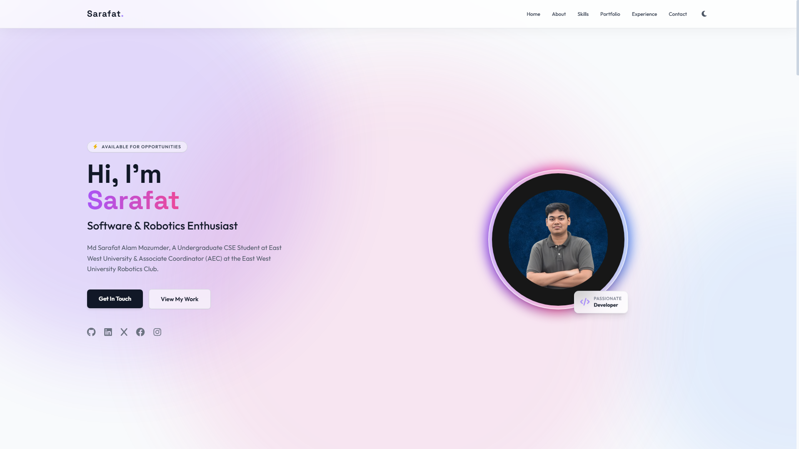

# 🚀 Md Sarafat Alam Mozumder - Developer Portfolio

> A modern, glassmorphism-inspired personal portfolio website built to showcase my software engineering projects, robotics experience, and technical skills.



[](https://sarafat.pages.dev/)
[](https://pages.cloudflare.com/)
[](https://opensource.org/licenses/MIT)

---

## ✨ Features

- **Modern UI/UX:** Built with a premium 3D glassmorphism aesthetic and smooth scroll animations.
- **Fully Responsive:** Flawless layout scaling across desktop, tablet, and mobile displays.
- **Dark/Light Mode:** Seamless theme toggling with automatic user preference detection.
- **Functional Contact Form:** Serverless email integration using Formspree to handle inquiries directly from the static frontend.
- **Dynamic Interactive Elements:** Features a custom JavaScript-rendered animated canvas favicon.
- **High-Performance:** Lightweight, zero-dependency architecture ensuring lightning-fast load times.

## 🛠️ Tech Stack

- **Markup & Styling:** HTML5, Tailwind CSS
- **Interactivity:** Vanilla JavaScript (ES6+)
- **Deployment & Hosting:** Cloudflare Pages (You can use Netlify/Vercel)
- **Typography:** Google Fonts (Display)
- **Form Handling:** Formspree API
- **Icons:** FontAwesome


## 💻 Local Development

To run this project locally on your machine:

1. **Clone the repository:**
   ```bash
   git clone [https://github.com/SarafatAlamIrfan/YOUR_REPO_NAME.git](https://github.com/SarafatAlamIrfan/YOUR_REPO_NAME.git)

2. **Navigate to the directory:**
     cd YOUR_REPO_NAME

3. **Launch a local server:**
    python -m http.server 8000

4. **Open in browser:**
    Navigate to http://localhost:8000

## 🤝 Open Source & How to Use
    I believe in open-source learning! This portfolio template is completely open for anyone to use, copy, edit, and adapt for their own personal websites.

    If you want to use this design:

    Fork this repository to your own GitHub account.

    Update the index.html file with your own personal information, projects, and skills.

    Replace the images in the image/ folder with your own.

    **Note on Contact Form:** The contact form is powered by Formspree. Remember to create your own free Formspree account and replace the `await fetch(" YOUR_ENDPOINT_HERE "` link in the HTML form with your own endpoint so you receive the emails!

    Deploy for free using Cloudflare Pages, Netlify, or GitHub Pages!

   (A star ⭐ on the repository is always appreciated if you found it helpful!)

## 📫 Connect With Me
    Website: sarafat.pages.dev

    LinkedIn: linkedin.com/in/sarafatalamirfan

## 📄 License
    This project is licensed under the MIT License - see the LICENSE file for details.


## Designed and built by Md Sarafat Alam Mozumder.
